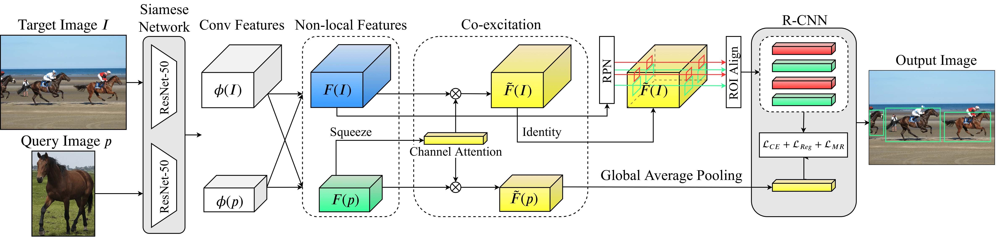

# One-Shot Object Detection with Co-Attention and Co-Excitation

## Introduction



This project is a pure pytorch implementation of *One-Shot Object Detection*. A majority of the code is modified from [jwyang/faster-rcnn.pytorch](https://github.com/jwyang/faster-rcnn.pytorch).  

[**One-Shot Object Detection with Co-Attention and Co-Excitation**](https://arxiv.org/abs/1911.12529)  
Ting-I Hsieh, Yi-Chen Lo, Hwann-Tzong Chen, Tyng-Luh Liu
Neural Information Processing Systems (NeurIPS), 2019

### What we are doing and going to do

- [x] Support tensorboardX.
- [x] Upload the ImageNet pre-trained model.
- [x] Provide Reference image.
- [x] Provide checkpoint model.
- [ ] Train PASCAL_VOC datasets

## Preparation

First of all, clone the code

```bash
git clone https://github.com/timy90022/One-Shot-Object-Detection.git
```

### 1. Prerequisites

* Python or 3.6
* Pytorch 1.0

### 2. Data Preparation

* **COCO**: Please also follow the instructions in [py-faster-rcnn](https://github.com/rbgirshick/py-faster-rcnn#beyond-the-demo-installation-for-training-and-testing-models) to prepare the data.
See the scripts provided in this repository.

### 3. Pretrained Model

We use ResNet50 as the pretrained model in our experiments. This pretrained model is trained by excluding all
COCO-related ImageNet classes, which is acheived via matching the WordNet synsets of ImageNet classes to COCO
classes. As a result, we keep only 933,052 images from the remaining 725 classes, while the original dataset contains 1,284,168 images of 1000 classes. The pretrained model is available at

* ResNet50: [Google Drive](https://drive.google.com/file/d/1SL9DDezW-neieqxWyNlheNefwgLanEoV/view?usp=sharing)

Download and unzip them into the ../data/

### 4. Reference images

The reference images are retrieved by cropping out the patches with respect to the predicted bounding boxes of Mask R-CNN, and the bounding boxes need to satisfy the following conditions:

* The IOU threshold    > 0.5
* The score confidence > 0.7

The reference images are available at
* Reference file: [Google Drive](https://drive.google.com/file/d/1O1AQtjozgpdtuETGE6X4UItpqcVPUiXH/view?usp=sharing)

Download and unzip them into the ../data/

### 5. Compilation

This step can be referred to [jwyang/faster-rcnn.pytorch](https://github.com/jwyang/faster-rcnn.pytorch).
Install all the python dependencies using pip:

```bash
pip install -r requirements.txt
```

Compile the cuda dependencies using following simple commands:

```bash
cd lib
python setup.py build develop
```

It will compile all the modules you need, including NMS, ROI_Pooing, ROI_Align, and ROI_Crop. The default version is compiled with Python 2.7. 

**As pointed out in this [issue](https://github.com/jwyang/faster-rcnn.pytorch/issues/16), if you encounter some error during the compilation, you might miss to export the CUDA paths to your environment.**

## Train

Before training, set the right directory to save and load the trained models. Change the arguments "save_dir" and "load_dir" in trainval_net.py and test_net.py to adapt to your environment.

In coco dataset, we split it into 4 groups. It will train and test different category. Just to adjust "*--g*"(1~4). If you want to train other settings, you should sepcify "*--g 0*"

If you want to train parts of the dataset, try to modify "*--seen*". 

* 1 --> Training, session see train_categories(config file) class
* 2 --> Testing, session see test_categories(config file) class
* 3 --> session see train_categories + test_categories class

To train a model with ResNet50 on COCO, simply run

```bash
CUDA_VISIBLE_DEVICES=$GPU_ID python trainval_net.py \
                   --dataset coco --net res50 \
                   --bs $BATCH_SIZE --nw $WORKER_NUMBER \
                   --lr $LEARNING_RATE --lr_decay_step $DECAY_STEP \
                   --cuda --g $SPLIT --seen $SEEN
```

Above, BATCH_SIZE and WORKER_NUMBER can be set adaptively according to your GPU memory size. **On NVIDIA V100 GPUs with 32G memory, it can be up to batch size 16**.

If you have multiple (say 8) V100 GPUs, then just use them all! Try

```bash
python trainval_net.py --dataset coco --net res50 \
                       --bs $BATCH_SIZE --nw $WORKER_NUMBER \
                       --lr $LEARNING_RATE --lr_decay_step $DECAY_STEP \
                       --cuda --g $SPLIT --seen $SEEN --mGPUs

```

## Test

If you want to evlauate the detection performance of ResNet50 model on COCO test set, you can train by yourself or download the models from [Google Drive](https://drive.google.com/file/d/1FV7TpTSgF0pwGxshqUSK-AvhXHSAObo4/view?usp=sharing) 
and unzip them into the ```./models/res50/```.

Simply run

```bash
python test_net.py --dataset coco --net res50 \
                   --s $SESSION --checkepoch $EPOCH --p $CHECKPOINT \
                   --cuda --g $SPLIT
```

Specify the model session, checkepoch and checkpoint, e.g., SESSION=1, EPOCH=10, CHECKPOINT=1663.

If you want to test our model checkpoint, simple run  

For coco first group:

```bash
python test_net.py --s 1  --g 1 --a 4 --cuda
```

For coco second group:

```bash
python test_net.py --s 2  --g 2 --a 4 --cuda
```

## Acknowledgments

Code is based on [jwyang/faster-rcnn.pytorch](https://github.com/jwyang/faster-rcnn.pytorch) and [AlexHex7/Non-local_pytorch](https://github.com/AlexHex7/Non-local_pytorch). 
